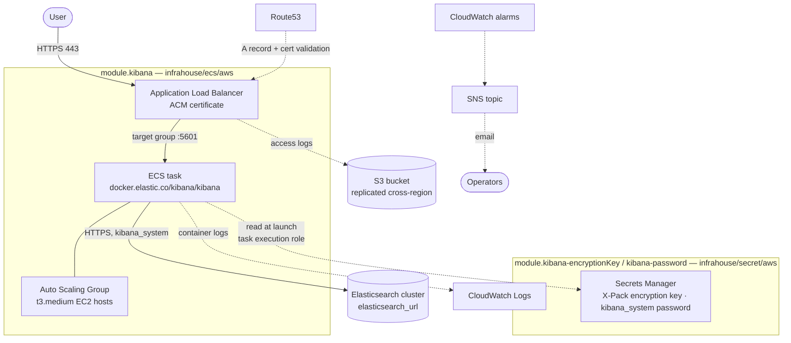

# Architecture

This module is a thin composition layer: it instantiates three published InfraHouse modules and owns
only two resources of its own — the random encryption key and the IAM policy that lets the ECS task
read its secrets. Terraform loads every `*.tf` file regardless of name; the source is split by
concern.

## Component overview

## Composed modules

| Module | Source | Role |
|--------|--------|------|
| `module.kibana` | `infrahouse/ecs/aws` | ECS cluster with an EC2 capacity provider, Auto Scaling Group, ECS service and task definition, Application Load Balancer with an ACM certificate and DNS records, CloudWatch logs, alarms and SNS topic, ALB access-log bucket with cross-region replication. |
| `module.kibana-encryptionKey` | `infrahouse/secret/aws` | Secrets Manager secret holding the X-Pack encryption key, readable by the ECS task execution role. |
| `module.kibana-password` | `infrahouse/secret/aws` | Secrets Manager secret holding the `kibana_system` password, readable by the ECS task execution role. |

## Source files

- **`main.tf`** — the core `module.kibana`. Runs the official Kibana image
  (`docker.elastic.co/kibana/kibana:${var.kibana_version}`) on container port 5601 and configures
  Kibana entirely through environment variables and ECS secrets. Fixes the sizing
  (`t3.medium` hosts, 1024 CPU units and 2 GB for the container), the health checks, and the
  900-second health-check grace periods that give Kibana time to migrate its saved-objects indices
  on first start.
- **`secrets.tf`** — a `random_string` encryption key and the two `infrahouse/secret/aws` instances
  that store it and the `kibana_system` password. Both list the ECS task execution role in `readers`.
- **`iam.tf`** — the `task_role_exec` IAM policy granting `secretsmanager:GetSecretValue` on exactly
  those two secret ARNs. It is attached to the task execution role through the ECS module's
  `execution_extra_policy`, and it carries the `module_version` tag.
- **`datasources.tf`** — the caller identity and the Route53 zone the Kibana URL is built from.
- **`locals.tf`** — the module version, the derived service name and Kibana URL, and the default tags.
- **`outputs.tf`** — the Kibana URL, the `kibana_system` credentials, and the load balancer ARN.

## Naming and DNS

Everything is derived from `elasticsearch_cluster_name`:

| Thing | Value |
|-------|-------|
| ECS service name | `<elasticsearch_cluster_name>-kibana` |
| DNS record | `<elasticsearch_cluster_name>-kibana.<zone domain>` |
| Kibana URL (`kibana_url` output) | `https://<elasticsearch_cluster_name>-kibana.<zone domain>` |
| Secret name prefixes | `<elasticsearch_cluster_name>-kibana-`, `<elasticsearch_cluster_name>-kibana-password-` |

There is no input to set the hostname directly. Renaming the cluster renames the DNS record, the
service and the secrets.

## Kibana configuration

Kibana is configured through the container environment, never through a config file:

| Environment variable | Value |
|----------------------|-------|
| `SERVER_NAME` | `<elasticsearch_cluster_name>-kibana.<zone domain>` |
| `SERVER_PUBLICBASEURL` | The `kibana_url` output. |
| `ELASTICSEARCH_HOSTS` | `elasticsearch_url`. |
| `ELASTICSEARCH_USERNAME` | `kibana_system`. |
| `ELASTICSEARCH_REQUEST_TIMEOUT` | `elasticsearch_request_timeout` converted to milliseconds. |

And four values that arrive as ECS `secrets` (Secrets Manager ARNs the ECS agent resolves at task
launch, so they never appear in the task definition):

| Secret | Source |
|--------|--------|
| `XPACK_ENCRYPTEDSAVEDOBJECTS_ENCRYPTIONKEY` | `module.kibana-encryptionKey` |
| `XPACK_SECURITY_ENCRYPTIONKEY` | `module.kibana-encryptionKey` |
| `XPACK_REPORTING_ENCRYPTIONKEY` | `module.kibana-encryptionKey` |
| `ELASTICSEARCH_PASSWORD` | `module.kibana-password` |

The three X-Pack keys share one 32-character random string. It is generated by Terraform and stored
in state and in Secrets Manager; changing it invalidates the encrypted saved objects (alerting rules,
reporting jobs) that were written with it.

## Request and data flow

1. A user opens `https://<cluster>-kibana.<zone domain>`; Route53 resolves it to the load balancer.
2. The ALB terminates TLS with the ACM certificate and forwards to the task on port 5601.
3. The ECS agent pulls the secrets from Secrets Manager using the **task execution role** and starts
   the container with them in its environment.
4. Kibana authenticates to Elasticsearch at `elasticsearch_url` as `kibana_system` and stores all of
   its state — saved objects, dashboards, index patterns — in the cluster. Nothing is kept on the
   instance, so a task or host can be replaced at any time.
5. End users authenticate against Elasticsearch itself (the `elastic` superuser, or any user you
   create); Kibana forwards their credentials to the cluster.

## Health checks

| Check | Target | Purpose |
|-------|--------|---------|
| Container health check | `curl -sqf http://localhost:5601/status` | ECS restarts the task when Kibana stops answering. |
| ALB health check | `GET /login`, expecting HTTP 200 | Only a Kibana that can serve its login page receives traffic. |

Both the ASG and the ECS service allow a 900-second grace period. Kibana's first start is slow: it
creates and migrates its system indices in Elasticsearch before serving `/login`.

## Timeouts

`elasticsearch_request_timeout` (default 4000 seconds) drives two settings at once: the ALB
`idle_timeout` and Kibana's `ELASTICSEARCH_REQUEST_TIMEOUT`. Keeping them equal is deliberate — if
the load balancer timed out first, a long-running search would be cut off in the browser while Kibana
was still waiting for the cluster. Match this value to the idle timeout of the load balancer in front
of the Elasticsearch master nodes (`idle_timeout_master` in the elasticsearch module).

## Providers

The module needs two AWS provider configurations:

- `aws` — everything except DNS. It also reads the Route53 zone to build the Kibana URL, so it needs
  read access to the zone even when the zone lives in another account.
- `aws.dns` — passed through to the ECS module, which creates the Route53 records for the service and
  for ACM certificate validation.

Callers must supply both in their `providers` block.
